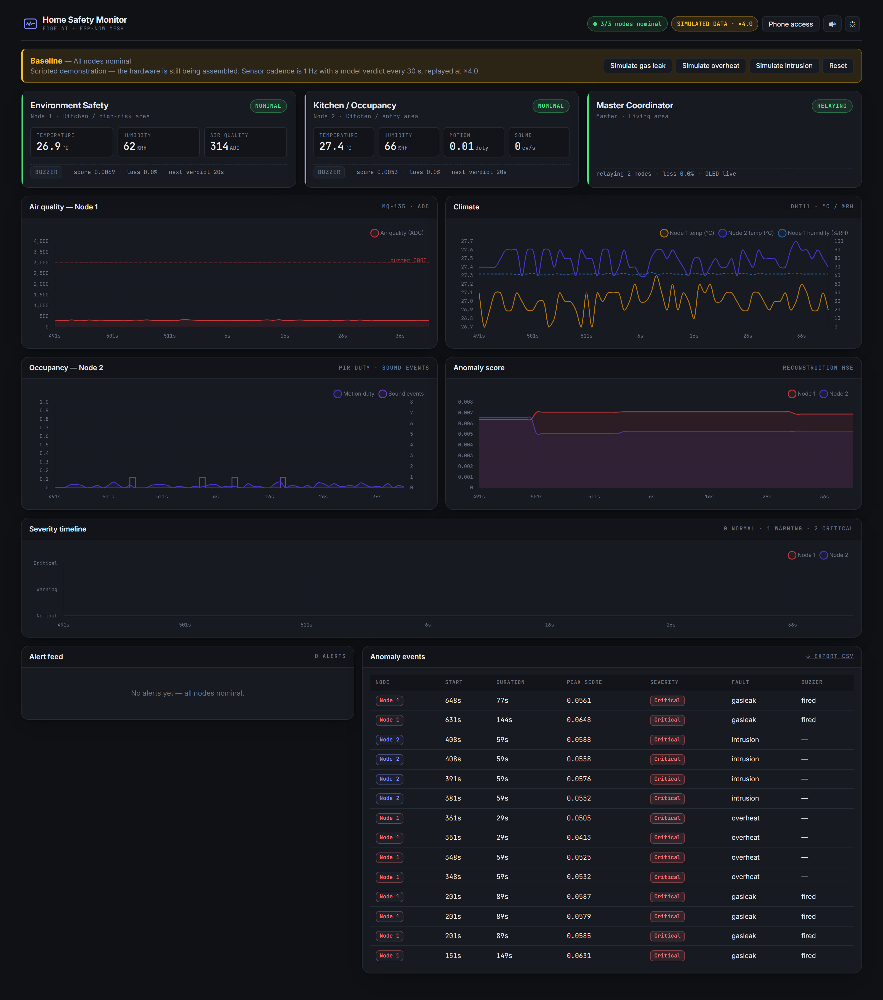
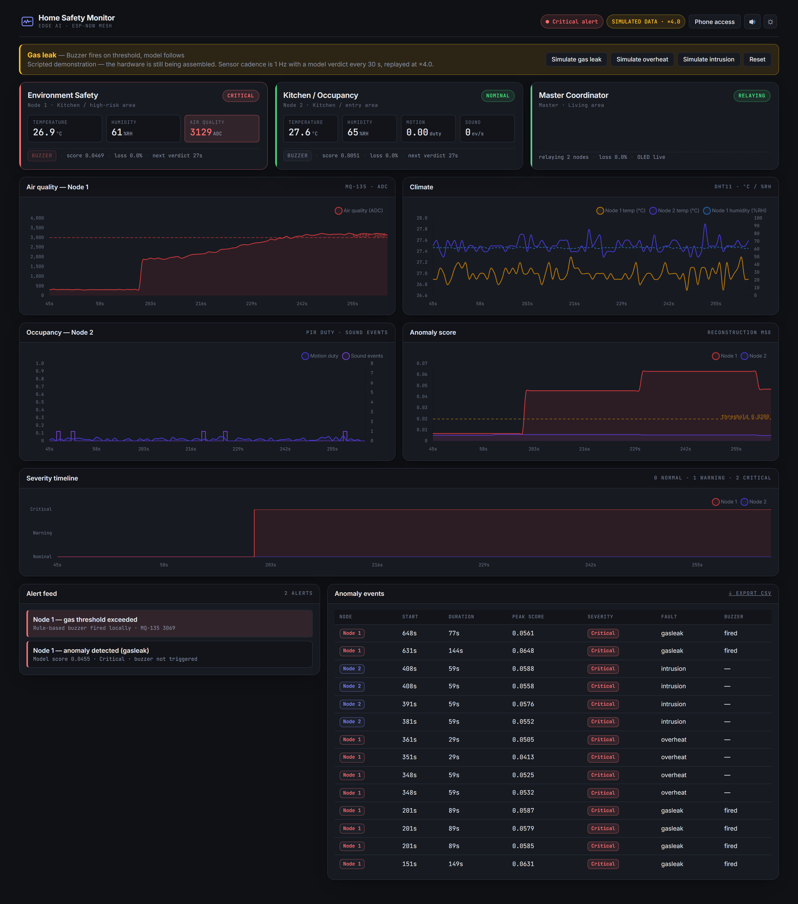
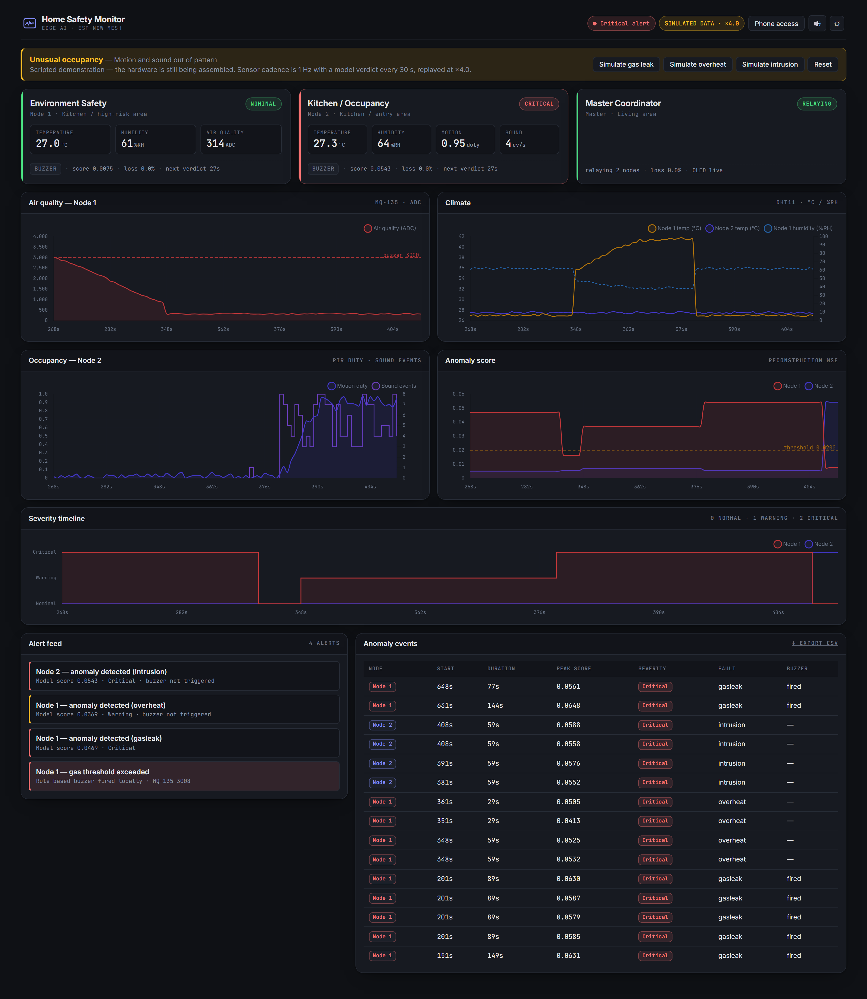
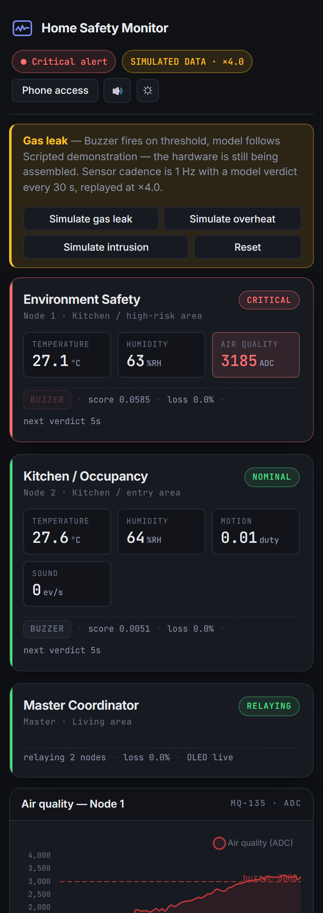

# Edge AI Anomaly Detection System

Offline home-safety monitoring on ESP32. Three ESP-NOW nodes sense, a per-node LSTM-VAE
runs on-device via TFLite Micro, and a local dashboard aggregates the lot. No router, no
broker, no cloud, no internet — at any point.

## Dashboard

Three-node operations console. Node cards carry live readings with real units, the
rule-based buzzer is shown **separately** from the ML verdict, and every anomaly run is
logged per node and exportable as CSV.



**Gas leak.** MQ-135 crosses 3000 ADC, the rule-based buzzer fires immediately, and the
model verdict follows on the next 30-second stride:



**Thermal rise — the safety invariant, visible.** The model flags an anomaly and the buzzer
stays silent, because the two paths are independent and the model never drives the buzzer:



**On a phone**, over the local network — the dashboard shows a QR code to scan:



> **The screenshots above are simulated data.** The hardware is still being assembled, so
> the dashboard ships with a scripted incident scenario (`--demo`) that is always labelled
> `SIMULATED DATA` on screen. Real captures replace these once the nodes are recording —
> see [ROADMAP.md](ROADMAP.md).

```bash
pip install -r dashboard/requirements.txt

python dashboard/app.py --demo --lan     # scripted scenario, reachable from your phone
python dashboard/app.py --port COM5      # live, reading the Master over USB
```

A data source is required. Omitting both is an error rather than a silent fall back to
synthetic data, because a dashboard of fabricated readings that looks live is worse than one
that refuses to start.

## Architecture

```
[Node 1: MQ-135 + DHT11]      [Node 2: PIR + sound + DHT11]
            │                              │
            └────────── ESP-NOW ───────────┘
                          │
                   [Master Node + OLED]
                          │ Serial (CSV or JSON)
  [Python data collector]
       │
  [ML training pipeline]  →  [TFLite model]
       │                            │
  [evaluate.py]          [ESP32 on-device inference]
       │                            │
  [eval plots]           [Flask + JS dashboard]
```

## Hardware Required

| Component       | Purpose                          |
| --------------- | -------------------------------- |
| ESP32 dev board | Microcontroller                  |
| MPU-6050        | 6-axis accelerometer + gyroscope |
| Jumper wires    | Connections                      |
| USB cable       | Power + serial communication     |

### Wiring

| MPU-6050 Pin | ESP32 Pin |
| ------------ | --------- |
| VCC          | 3.3V      |
| GND          | GND       |
| SDA          | GPIO 21   |
| SCL          | GPIO 22   |

---

## Project Structure

```
edge-ai-anomaly-detection/
├── firmware/                    # ESP32 C++ firmware (PlatformIO)
│   ├── src/main.cpp             # Dual-mode: data-collection + TFLite inference (+ optional fault classifier)
│   ├── include/
│   │   ├── config.h             # Timing, INFERENCE_MODE / CLASSIFIER_ENABLED flags
│   │   ├── sensor_profile.h     # Per-node pin map + feature layout (confirm vs schematics)
│   │   ├── model_data.h         # generated by ml/convert_tflite.py
│   │   ├── model_meta.h         # generated by ml/convert_tflite.py
│   │   ├── classifier_data.h    # generated by ml/convert_tflite.py (if classifier trained)
│   │   └── classifier_meta.h    # generated by ml/convert_tflite.py (if classifier trained)
│   ├── src/
│   │   ├── main.cpp             # Entry point - mode, timing, output
│   │   ├── sampler.cpp          # Per-profile feature row assembly
│   │   └── sensors/             # DHT11, MQ-135, PIR, sound drivers
│   └── platformio.ini           # One environment per physical node
├── data_collection/             # Phase 1 — Python serial data collector
│   ├── serial_listener.py       # Detects the node profile from its header line
│   ├── raw/<profile>/           # Recordings, filed per node profile
│   └── requirements.txt
├── ml/                          # Phases 2, 2.5 & 3 — ML training + TFLite export
│   ├── train.py                 # Train LSTM autoencoder (normal data only)
│   ├── evaluate.py              # Compute metrics + error distribution plots
│   ├── train_classifier.py      # Train fault-type classifier (labeled anomaly data)
│   ├── convert_tflite.py        # Quantize → C header for ESP32 (autoencoder + classifier)
│   ├── requirements.txt
│   └── models/                  # created by train.py / train_classifier.py
│       ├── autoencoder.keras
│       ├── autoencoder_int8.tflite
│       ├── scaler.pkl
│       ├── threshold.txt
│       ├── config.json
│       ├── loss_curve.png
│       ├── eval_histogram.png
│       ├── roc_curve.png
│       ├── classifier.keras
│       ├── classifier_labels.json
│       ├── classifier_config.json
│       └── classifier_confusion.png
├── dashboard/                   # Phase 4 — Flask + JS real-time dashboard
│   ├── app.py
│   ├── requirements.txt
│   ├── templates/index.html
│   └── static/js/dashboard.js
└── README.md
```

---

## Phase 1 — Data Collection

### 1. Flash the firmware (collection mode)

`firmware/include/config.h` must have `INFERENCE_MODE 0` (the default).

```bash
cd firmware
pio run --target upload
pio device monitor        # verify CSV header + rows in terminal
```

### 2. Collect training data

```bash
cd data_collection
pip install -r requirements.txt

# Normal operation — the only label the detector trains on
python serial_listener.py --port COM3 --duration 3600 --label normal

# Anything that is not normal. Use a descriptive fault label, not "anomaly":
python serial_listener.py --port COM3 --duration 300 --label gasleak
```

Recordings are saved to `data_collection/raw/<profile>/`, where the profile is
detected from the header line the node prints. Node 1 and Node 2 have different
columns, so filing them separately is what stops them being blended into one
model. Collect multiple sessions — the more data, the better the model.

**On labels.** There are only two categories that matter:

| Label         | Used by                                                                               |
| ------------- | ------------------------------------------------------------------------------------- |
| `normal`      | `train.py` (the only data the detector is fitted on) and as the evaluation negatives  |
| anything else | evaluation positives in `evaluate.py`, **and** a fault class in `train_classifier.py` |

So a descriptive label such as `drop` does double duty: it gives `evaluate.py` the
positives it needs for ROC-AUC _and_ gives the classifier a named class. A generic
`anomaly` label still counts as an evaluation positive but is reserved, so it never
becomes a fault class — prefer descriptive labels and you never need to record twice.

---

## Phase 2 — Train the Model

```bash
cd ml
pip install -r requirements.txt

python train.py --profile env_safety        # 60 s window, 30 s stride, 50 epochs
python train.py --profile kitchen --window 60 --stride 30 --epochs 100

python evaluate.py                           # profile/window read from config.json
```

`--profile` selects the feature layout (from `ml/profiles.py`) and reads that
node's data from `raw/<profile>/`. `train.py` trains an LSTM autoencoder on
normal-only data, then sets the anomaly threshold at the 95th percentile of
validation reconstruction error. It records the profile, window, and stride into
`config.json`, so `evaluate.py`, `train_classifier.py`, and `convert_tflite.py`
read them back rather than re-assuming a default. Outputs:
`models/autoencoder.keras`, `scaler.pkl`, `threshold.txt`, `config.json`.

---

## Phase 2.5 — Fault Classification (optional)

The VAE above only answers "is this anomalous?". This optional step adds a
second, small classifier that guesses _what kind_ of anomaly it is (root-cause
hint), reported alongside the severity.

### 1. Collect labeled fault data

```bash
cd data_collection
python serial_listener.py --port COM3 --duration 60 --label drop
python serial_listener.py --port COM3 --duration 60 --label shake
python serial_listener.py --port COM3 --duration 60 --label imbalance
```

Any label other than `normal`/`anomaly` becomes a distinct fault class —
collect at least two. More sessions per label = better classification.
These same recordings are also the positives `evaluate.py` scores ROC-AUC on,
so there is no separate "anomaly" collection step.

### 2. Train the classifier

```bash
cd ml
python train_classifier.py                 # profile + window read from config.json
```

Extracts per-feature statistical features (mean/std/min/max/peak-to-peak) from
each window and trains a small Dense classifier — much lighter than a second
LSTM, and needs far less labeled data. Outputs `models/classifier.keras`,
`models/classifier_labels.json`, `models/classifier_config.json`, and a
confusion matrix at `models/classifier_confusion.png`.

### 3. Export + enable on-device

```bash
cd ml
python convert_tflite.py     # also exports the classifier if classifier.keras exists
```

Then in `firmware/include/config.h`:

```c
#define CLASSIFIER_ENABLED 1    // requires INFERENCE_MODE 1
```

Flash as usual. The JSON serial output gains a `"fault"` field (`"none"` when
no anomaly, else the predicted fault-type name), and the dashboard shows a
color-coded fault badge plus a "Fault" column in the anomaly event log.

---

## Phase 3 — Deploy to ESP32

### 1. Convert model to TFLite + C header

```bash
cd ml
python convert_tflite.py              # int8 quantization (recommended)
python convert_tflite.py --no-quantize    # float32 fallback
```

Requires the `tf-keras` package (in `requirements.txt`) — the VAE's LSTM
layers need Keras 2's legacy RNN tracing for TFLite to fuse them into the
efficient `UnidirectionalSequenceLSTM` op the firmware runs; `ml/train.py`,
`evaluate.py`, and `convert_tflite.py` all set `TF_USE_LEGACY_KERAS=1`
automatically.

Writes `firmware/include/model_data.h` and `firmware/include/model_meta.h`.

### 2. Enable inference mode

Edit `firmware/include/config.h`:

```c
#define INFERENCE_MODE 1    // was 0
```

### 3. Enable TFLite Micro library

Uncomment in `firmware/platformio.ini`:

```ini
spaziochirale/Chirale_TensorFLowLite@^2.0.0
```

### 4. Flash

```bash
cd firmware
pio run --target upload
pio device monitor    # JSON: {"ts":…,"err":…,"anomaly":0|1,"ax":…,"ay":…,"az":…}
```

The onboard LED (GPIO 2) lights when an anomaly is detected.

---

## Phase 4 — Dashboard

```bash
cd dashboard
pip install -r requirements.txt

python app.py --port COM3          # live ESP32 data (INFERENCE_MODE=1 required)
python app.py --demo               # synthetic data, no hardware needed
```

Open `http://127.0.0.1:5000/` in a browser.

**Features:**

- Live reconstruction-error chart with adjustable threshold line
- Accelerometer XYZ chart
- Anomaly counter + rate KPIs
- Color-coded status badge (green = normal, red = anomaly)
- Adjustable history window (20–300 frames)
- Fault-type badge + event-log column when the Phase 2.5 classifier is enabled
  (demo mode cycles through synthetic `drop`/`shake`/`imbalance` labels)

---

## Tech Stack

| Layer          | Technology                                     |
| -------------- | ---------------------------------------------- |
| Firmware       | C++ · Arduino framework · PlatformIO           |
| Sensor         | MPU-6050 via Adafruit library                  |
| ML training    | Python · TensorFlow/Keras · scikit-learn       |
| Edge inference | TensorFlow Lite Micro (Chirale_TensorFLowLite) |
| Dashboard      | Flask · Server-Sent Events · Chart.js          |
| Communication  | Serial JSON (inference) / CSV (collection)     |

## Tuning Tips

- **More normal data** — aim for 5+ minutes to lower the false-positive rate.
- **Lower `--threshold-pct`** (e.g. 90) — more sensitive, more false positives.
- **Larger `--window`** — more context per decision, but slower reaction time.
- If the model is too large for the ESP32 arena, reduce LSTM units in `train.py`
  from 64 → 32, or increase `kTensorArenaSize` in `firmware/src/main.cpp`.
